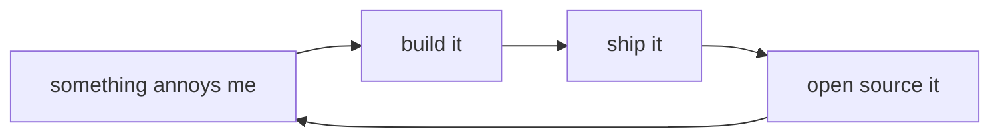

<!-- [1/3] you're still reading. -->


```diff
+ $ whoami
+ lucas
+
+ $ git diff ~/.philosophy
- plan for six months, ship nothing
+ ship this week, iterate from there
- wait for the perfect abstraction
+ build with what you have now
- add another layer of framework
+ go one layer deeper
- keep it closed, monetize the API
+ open it up, let others build on it
- "we need more meetings about this"
+ just build the damn thing
+
+ $ lucas --status
+ building the next thing.
```

<!-- [2/3] most people just scroll. -->



> "they mass produce walls. I mass produce doors."
> <sup>— me, probably</sup>

```
$ ls ~/projects --pinned

  NAME                LANG  DESCRIPTION                          STATUS
  ──────────────────  ────  ───────────────────────────────────  ──────
  tossinvest-cli      Go    Toss Securities from the terminal    beta
  smartstore-cli      Go    Naver Smart Store from the terminal  beta
  openkakao           Rust  KakaoTalk via LOCO protocol          beta
  capacities-cli      Rust  Capacities.io full CRUD              stable
  claude-statusline   TS    rich statusline for Claude Code      stable
  opencode-kilo-auth  TS    OpenCode plugin for Kilo Gateway     stable

  6 items
```
> <sub>[tossinvest-cli](https://github.com/JungHoonGhae/tossinvest-cli) · [smartstore-cli](https://github.com/JungHoonGhae/smartstore-cli) · [openkakao](https://github.com/JungHoonGhae/openkakao) · [capacities-cli](https://github.com/JungHoonGhae/capacities-cli) · [claude-statusline](https://github.com/JungHoonGhae/claude-statusline) · [opencode-kilo-auth](https://github.com/JungHoonGhae/opencode-kilo-auth)</sub>

<details>
<summary>ㅤ</summary>
<br>
you found the empty door. nice.
</details>

<!-- [3/3] builders read the source. welcome. -->

---

come find me on [LinkedIn](https://www.linkedin.com/in/junghoonghae/) <br/>
or follow [@lucas_ghae](https://x.com/lucas_ghae) on X

<a href="https://www.buymeacoffee.com/lucas.ghae">
  
</a>
