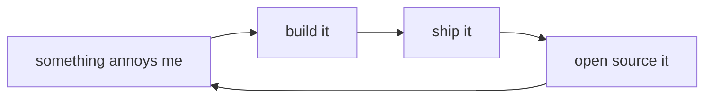

<!-- you're reading the source. respect. -->
<!-- if you got here, you think like me. -->

[](https://www.linkedin.com/in/junghoonghae/)


```diff
+ $ whoami
+ lucas — builds open interfaces for closed systems
+
+ $ lucas --philosophy
+ protocol-level, kernel-level.
+ the lower you go, the fewer people are there,
+ and the clearer things become.
```



## `ls ~/projects`

| | what | how |
|---|---|---|
| 📈 | **[tossinvest-cli](https://github.com/JungHoonGhae/tossinvest-cli)** | Toss Securities from the terminal |
| 🛒 | **[smartstore-cli](https://github.com/JungHoonGhae/smartstore-cli)** | Naver Smart Store from the terminal |
| 💬 | **[openkakao](https://github.com/JungHoonGhae/openkakao)** | KakaoTalk via LOCO protocol on macOS |
| 📝 | **[capacities-cli](https://github.com/JungHoonGhae/capacities-cli)** | Capacities.io full CRUD |
| 🖥️ | **[claude-statusline](https://github.com/JungHoonGhae/claude-statusline)** | rich statusline for Claude Code |
| 🧠 | **[skills](https://github.com/JungHoonGhae/skills)** | skill packs for AI agents |

- [x] scratch own itch
- [x] ship it
- [ ] rest

---

<a href="https://www.buymeacoffee.com/lucas.ghae">
  
</a>
