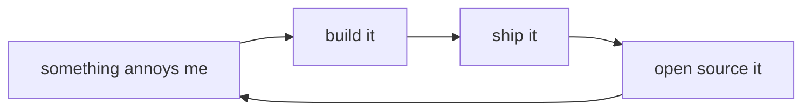

<!-- you're reading the source. respect. -->
<!-- if you got here, you think like me. -->

[](https://www.linkedin.com/in/junghoonghae/)


```diff
+ $ whoami
+ lucas — builds open interfaces for closed systems
+
+ $ lucas --philosophy
+ protocol-level, kernel-level.
+ the lower you go, the fewer people are there,
+ and the clearer things become.
```



```
$ ls ~/projects --pinned

  NAME                LANG    DESCRIPTION                          STATUS
  ──────────────────  ──────  ───────────────────────────────────  ──────
  tossinvest-cli      Go      Toss Securities from the terminal    beta
  smartstore-cli      Go      Naver Smart Store from the terminal  beta
  openkakao           Rust    KakaoTalk via LOCO protocol          stable
  capacities-cli      Rust    Capacities.io full CRUD              stable
  claude-statusline   TS      rich statusline for Claude Code      stable
  skills              YAML    skill packs for AI agents            active

  6 items
```
> <sub>[tossinvest-cli](https://github.com/JungHoonGhae/tossinvest-cli) · [smartstore-cli](https://github.com/JungHoonGhae/smartstore-cli) · [openkakao](https://github.com/JungHoonGhae/openkakao) · [capacities-cli](https://github.com/JungHoonGhae/capacities-cli) · [claude-statusline](https://github.com/JungHoonGhae/claude-statusline) · [skills](https://github.com/JungHoonGhae/skills)</sub>

- [x] scratch own itch
- [x] ship it
- [ ] rest

---

<a href="https://www.buymeacoffee.com/lucas.ghae">
  
</a>
